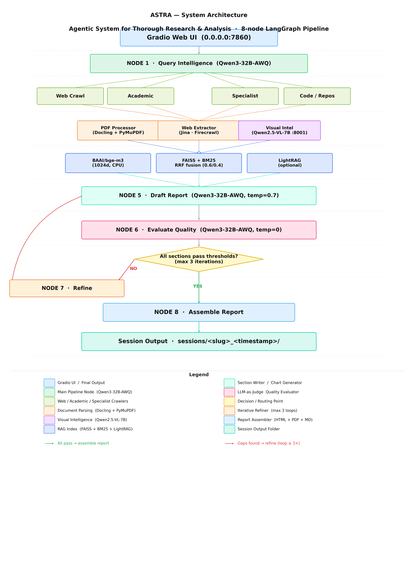

# ASTRA — Agentic System for Thorough Research & Analysis

ASTRA is a fully local, multi-agent research pipeline that turns a natural-language query into a publication-quality report. It crawls the web and academic databases in parallel, parses and understands PDFs (text *and* figures), builds a hybrid vector/BM25 knowledge base, drafts each report section with inline citations and source figures, evaluates its own output with an LLM judge, and iteratively refines until quality thresholds are met. Every result is delivered as a self-contained HTML file (MathJax, embedded images), a PDF, and a Markdown document.

All inference runs locally via **vLLM** — no cloud LLM API is required.

---

## Table of Contents

1. [Installation](#installation)
2. [Running ASTRA](#running-astra)
3. [Configuration](#configuration)
4. [Agentic Architecture](#agentic-architecture)
5. [Tool Layer Reference](#tool-layer-reference)
6. [Output Structure](#output-structure)
7. [Layer Testing](#layer-testing)
8. [Troubleshooting](#troubleshooting)

---

## Installation- The app can run on a machine with at least 48GB GPU!

### Prerequisites

| Component | Requirement |
|-----------|-------------|
| GPU | NVIDIA RTX 6000 48GB VRAM |
| RAM | 64 GB+ system RAM |
| CPU | 8+ cores |
| Disk | ~80 GB (models + index data) |
| OS | Linux (Ubuntu 22.04+ tested) |
| Python | 3.12 |
| CUDA | 12.1+ |

### 1. Clone and create the environment

```bash
git clone https://github.com/your-org/ASTRA_OS.git
cd ASTRA_OS

conda create -n astra_os_312 python=3.12 -y
conda activate astra_os_312
```

### 2. Install Python dependencies

```bash
pip install -r requirements.txt
```

Some packages require system libraries:

```bash
# WeasyPrint (PDF rendering)
sudo apt-get install -y libpango-1.0-0 libpangoft2-1.0-0 libpangocairo-1.0-0 \
    libcairo2 libgdk-pixbuf2.0-0 libffi-dev shared-mime-info

# Mermaid CLI (optional, for architecture diagrams in reports)
npm install -g @mermaid-js/mermaid-cli
```

### 3. Start the vLLM inference servers

ASTRA requires two vLLM endpoints running before any research session.

**Main LLM — Qwen3-32B-AWQ** (query planning, section writing, quality evaluation):
```bash
CUDA_VISIBLE_DEVICES=0 vllm serve Qwen/Qwen3-32B-AWQ \
  --served-model-name astra-main \
  --port 8000 \
  --gpu-memory-utilization 0.50 \
  --tensor-parallel-size 1 \
  --reasoning-parser qwen3 \
  --enforce-eager \
  --trust-remote-code \
  --max-model-len 8192
```

**Vision LLM — Qwen2.5-VL-7B-Instruct** (describes scraped figures/charts for multimodal RAG):
```bash
CUDA_VISIBLE_DEVICES=0 vllm serve Qwen/Qwen2.5-VL-7B-Instruct \
  --served-model-name astra-vision \
  --port 8001 \
  --gpu-memory-utilization 0.46 \
  --max-model-len 4096 \
  --enforce-eager \
  --limit-mm-per-prompt '{"image": 1}'
```

> On a multi-GPU machine run each server on its own card by adjusting `CUDA_VISIBLE_DEVICES` (e.g. `0` for main, `4` for vision). The utilization values above are calibrated for a single RTX 4090 (24 GB) when sharing; lower them if you see OOM.
>
> **Auto-start:** `python main.py` automatically checks `/health` on both ports at startup and launches the servers if they are down, as long as `ASTRA_MAIN_MODEL` and `ASTRA_VISION_MODEL` are set in `.env`.
>
> Both servers should be running before starting a session. If port 8001 is down, figure VLM descriptions fall back to Docling captions but inline figure placement still works. If port 8000 is down, Nodes 1, 5, and 6 will error.

---

## Running ASTRA

### Gradio Web UI (recommended)

```bash
conda activate astra_os_312
python main.py
# Open http://localhost:7860
```

The UI uses a **two-phase flow**:
1. **Analyze Query** — runs Layer 1 only (enrich + expand). Shows the enriched query, an editable section outline, and up to two clarifying questions. Edit the plan before committing.
2. **Run Research** — feeds the (possibly edited) plan into the full 8-node pipeline and streams live progress. Produces HTML, PDF, and Markdown reports.

### CLI — single research session

```bash
python main.py --query "RAG variations and latest innovations in 2025"
```

Progress prints to the terminal via Rich panels. The final report paths appear in the session summary.

### CLI — headless

```bash
python main.py --query "your topic" --no-ui
```

---

## Configuration

All settings are loaded from `.env` via Pydantic. Create the file from the example template:

```bash
cp .env.example .env
# Edit .env — only the items marked Required need to be set before first run
```

### LLM Endpoints

| Variable | Default | Description |
|----------|---------|-------------|
| `VLLM_BASE_URL` | `http://localhost:8000/v1` | Main LLM OpenAI-compatible endpoint |
| `VLLM_API_KEY` | `not-needed` | Any string works for local vLLM |
| `ASTRA_MAIN_MODEL` | — | **Real HuggingFace model path** used by `vllm serve` for auto-start (e.g. `Qwen/Qwen3-32B-AWQ`) |
| `ASTRA_MAIN_MODEL_ALIAS` | `astra-main` | `--served-model-name` of the main vLLM server |
| `ASTRA_MAIN_MAX_TOKENS` | `4096` | Max tokens per section write / plan call |
| `ASTRA_MAIN_TEMPERATURE` | `0.7` | Temperature for section writing |
| `ASTRA_JUDGE_BASE_URL` | `http://localhost:8000/v1` | Endpoint for the LLM judge (can share main) |
| `ASTRA_JUDGE_MODEL_ALIAS` | `astra-main` | Model alias for the judge |
| `ASTRA_JUDGE_TEMPERATURE` | `0.0` | Judge always runs at zero temperature |
| `ASTRA_VISION_BASE_URL` | `http://localhost:8001/v1` | Vision LLM endpoint |
| `ASTRA_VISION_MODEL` | — | **Real HuggingFace model path** for vision auto-start (e.g. `Qwen/Qwen2.5-VL-7B-Instruct`) |
| `ASTRA_VISION_MODEL_ALIAS` | `astra-vision` | `--served-model-name` of the vision vLLM server |
| `ASTRA_VISION_ENABLED` | `true` | Disable to skip figure VLM description entirely |
| `ASTRA_VISION_MAX_TOKENS` | `1024` | Max tokens per figure description |
| `ASTRA_VISION_MAX_FIGURES` | `30` | Max figures to describe per session |
| `ASTRA_VISION_MIN_IMAGE_SIZE` | `150` | Minimum pixel dimension to accept a figure |

### Embeddings & Reranking

| Variable | Default | Description |
|----------|---------|-------------|
| `ASTRA_EMBEDDING_MODEL` | `BAAI/bge-m3` | HuggingFace model ID (1024-dim, multilingual) |
| `ASTRA_EMBEDDING_DEVICE` | `cpu` | `cpu` or `cuda` |
| `ASTRA_RERANKER_MODEL` | `BAAI/bge-reranker-v2-m3` | Cross-encoder reranker |
| `ASTRA_RERANKER_DEVICE` | `cpu` | `cpu` or `cuda` |
| `ASTRA_RERANKER_TOP_K` | `10` | Candidates kept after reranking |

### Web Search

| Variable | Default | Description |
|----------|---------|-------------|
| `TAVILY_API_KEY` | — | **Required for Tavily.** Get one at tavily.com. DDG is used as fallback when absent |
| `ASTRA_DUCKDUCKGO_MAX_RESULTS` | `10` | DDG results per query |
| `ASTRA_JINA_ENABLED` | `true` | Jina.ai reader for full-page markdown extraction |
| `ASTRA_FIRECRAWL_ENABLED` | `true` | Self-hosted Firecrawl scraper |
| `ASTRA_FIRECRAWL_BASE_URL` | `http://localhost:3002` | Firecrawl endpoint |

### Academic Sources

| Variable | Default | Description |
|----------|---------|-------------|
| `ASTRA_ARXIV_MAX_RESULTS` | `20` | arXiv papers per sub-query |
| `ASTRA_S2_API_KEY` | — | Semantic Scholar API key (optional; raises rate limits) |
| `ASTRA_OPENALEX_MAX_RESULTS` | `20` | OpenAlex papers per sub-query |
| `ASTRA_PUBMED_MAX_RESULTS` | `15` | PubMed articles per sub-query |
| `ASTRA_GITHUB_TOKEN` | — | GitHub token for higher rate limits on repo search |
| `ASTRA_PDF_DOWNLOAD_ENABLED` | `true` | Download open-access PDFs for figure extraction |

### Subscription Content (Optional)

| Variable | Description |
|----------|-------------|
| `ASTRA_MEDIUM_SESSION_COOKIE` | `sid` cookie value from browser DevTools after Medium login — unlocks paywalled posts |
| `ASTRA_SUBSTACK_SESSION_COOKIE` | `substack.sid` cookie — unlocks paid Substack newsletters |

### Document Processing

| Variable | Default | Description |
|----------|---------|-------------|
| `ASTRA_DOCLING_ENABLED` | `true` | Use Docling for PDF parsing (GPU-accelerated) |
| `ASTRA_DOCLING_DEVICE` | `cuda` | `cuda` or `cpu` |
| `ASTRA_DOCLING_OCR_ENABLED` | `true` | OCR for scanned PDFs |
| `ASTRA_DOCLING_TABLE_MODE` | `accurate` | `fast` or `accurate` table extraction |
| `ASTRA_PYMUPDF_FALLBACK_THRESHOLD_PAGES` | `5` | Fall back to PyMuPDF for PDFs under this page count |

### Retrieval & RAG

| Variable | Default | Description |
|----------|---------|-------------|
| `ASTRA_CHUNK_SIZE` | `512` | Approximate token window per chunk |
| `ASTRA_CHUNK_OVERLAP` | `64` | Overlap between adjacent chunks |
| `ASTRA_RETRIEVAL_TOP_K` | `20` | Candidates retrieved from FAISS+BM25 |
| `ASTRA_RETRIEVAL_RERANK_TOP_K` | `10` | Candidates kept after cross-encoder reranking |
| `ASTRA_RETRIEVAL_DENSE_WEIGHT` | `0.6` | RRF weight for dense (FAISS) results |
| `ASTRA_FIGURE_RELEVANCE_THRESHOLD` | `0.28` | Minimum bge-m3 cosine similarity for a scraped figure to be placed inline in a section. Raise (e.g. `0.38`) to be more selective; lower to include more figures |
| `ASTRA_LIGHTRAG_ENABLED` | `true` | Enable LightRAG knowledge graph for multi-hop queries |

### Quality Evaluation

| Variable | Default | Description |
|----------|---------|-------------|
| `ASTRA_EVAL_MIN_FACTUAL_ACCURACY` | `0.70` | Minimum factual accuracy before refinement |
| `ASTRA_EVAL_MIN_CITATION_FAITHFULNESS` | `0.80` | Minimum citation faithfulness |
| `ASTRA_EVAL_MIN_COMPLETENESS` | `0.60` | Minimum topic coverage |
| `ASTRA_EVAL_MIN_COHERENCE` | `0.70` | Minimum narrative coherence |
| `ASTRA_EVAL_MIN_RELEVANCE` | `0.80` | Minimum relevance to query |
| `ASTRA_EVAL_MAX_ITERATIONS` | `3` | Maximum refinement iterations before forced assembly |

### Output & Paths

| Variable | Default | Description |
|----------|---------|-------------|
| `ASTRA_SESSIONS_DIR` | `./data/sessions` | Root for per-query session folders |
| `ASTRA_OUTPUT_DIR` | `./output/reports` | Fallback output directory |
| `ASTRA_LOG_FILE` | `./data/logs/astra.log` | Global log file |
| `ASTRA_LOG_LEVEL` | `INFO` | `DEBUG`, `INFO`, `WARNING` |
| `ASTRA_CHART_DPI` | `150` | DPI for matplotlib chart exports |

### Observability

| Variable | Default | Description |
|----------|---------|-------------|
| `LANGCHAIN_TRACING_V2` | `true` | Enable LangSmith tracing |
| `LANGCHAIN_API_KEY` | — | **Required** if tracing is on — get from smith.langchain.com |
| `LANGCHAIN_PROJECT` | `ASTRA-Research-Agent` | LangSmith project name |

### UI

| Variable | Default | Description |
|----------|---------|-------------|
| `ASTRA_GRADIO_HOST` | `0.0.0.0` | Bind address for Gradio |
| `ASTRA_GRADIO_PORT` | `7860` | Port for Gradio |
| `ASTRA_GRADIO_SHARE` | `false` | Create a public Gradio share link |

---

## Agentic Architecture

ASTRA is implemented as an **8-node LangGraph state machine** with a conditional refinement loop. The flowchart below shows the complete pipeline including all sub-components, sidecars, and data paths.



### Pipeline summary

| Node | Responsibility | Key models / tools |
|------|---------------|-------------------|
| **1 · Query Intelligence** | Enrich query (infer expertise/purpose/implicit needs), expand → sub-queries + section outline | Qwen3-32B-AWQ |
| **2 · Parallel Crawl** | 15 source crawlers across web, academic, specialist, code repositories, and Wikipedia | Tavily, DDG, arXiv, OpenAlex, S2, PubMed, PWC, GitHub, Medium, Substack, HF Blog, Wikipedia |
| **3 · Document Processing** | Parse PDFs (text + tables + figures), extract and describe images | Docling (GPU), PyMuPDF, Qwen2.5-VL-7B |
| **4 · Index Knowledge** | Embed all chunks (text + figure), build FAISS + BM25 indices | BAAI/bge-m3, FAISS IndexFlatIP, BM25Okapi, LightRAG |
| **5 · Draft Report** | RAG-retrieve per section, rerank, write, match and inline source figures, auto-generate charts from data tables | bge-reranker-v2-m3, Qwen3-32B-AWQ, matplotlib / plotly |
| **6 · Evaluate Quality** | LLM judge scores 6 dimensions per section; flags sections below threshold | Qwen3-32B-AWQ (temp=0) |
| **7 · Refine** | Gap analysis, targeted re-crawl, knowledge base update, section rewrite (≤ 3 iterations) | Qwen3-32B-AWQ, all Layer 2–4 tools |
| **8 · Assemble Report** | Build self-contained HTML (primary), PDF, and Markdown | weasyprint, MathJax, matplotlib |

### Visual intelligence detail

Scraped figures are not just appended — they are semantically matched to sections and woven into the narrative:

1. **Extraction** — Docling pulls figures and tables from PDFs; web article images are scraped from HTML
2. **VLM description** — Qwen2.5-VL-7B produces structured `[Type] [Title] [Description] [Key Insight]` for each figure
3. **RAG indexing** — each figure becomes a RAG chunk with `chunk_type="figure"` and `image_path` in metadata, indexed alongside text chunks
4. **Per-section retrieval** — `figure_search()` runs a FAISS search restricted to figure chunks only; the `ASTRA_FIGURE_RELEVANCE_THRESHOLD` (cosine similarity) filters out off-topic figures from tangentially crawled papers
5. **Inline placement** — relevant figures are injected immediately after the paragraph with the highest keyword overlap with the figure description, using `_best_injection_point()`

---

## Tool Layer Reference

| Layer | File | Responsibility |
|-------|------|---------------|
| **1** | `astra/tools/layer1_query.py` | Query enrichment (`enrich_query`), query expansion, section planning |
| **2** | `astra/tools/layer2_crawlers.py` | 15 source crawlers + deduplication (incl. Wikipedia) |
| **3** | `astra/tools/layer3_docs.py` | PDF text/table extraction (Docling + PyMuPDF) |
| **3** | `astra/tools/layer3_vision.py` | Figure extraction, VLM description, figure RAG chunks |
| **4** | `astra/tools/layer4_rag.py` | FAISS, BM25, hybrid retrieval, reranking, `figure_search()` |
| **5** | `astra/tools/layer5_judge.py` | LLM-as-judge evaluation, gap detection |
| **6** | `astra/tools/layer6_report.py` | Section writing, chart generation, HTML/PDF/MD assembly |
| **7** | `astra/tools/layer7_refinement.py` | Gap analysis, re-research, knowledge base update |

---

## Output Structure

Each query creates an isolated session directory:

```
data/sessions/<query_slug>_<unix_timestamp>/
├── reports/
│   ├── ASTRA_Report.html     ← Primary: self-contained, MathJax, base64 images, active links
│   ├── ASTRA_Report.pdf      ← Print-quality PDF via weasyprint
│   └── ASTRA_Report.md       ← Markdown with chart image references
├── charts/
│   ├── chart_<section>.png   ← Auto-generated from data tables in section markdown
│   └── chart_<section>.svg
├── sources/
│   ├── pdfs/                 ← Downloaded open-access PDFs
│   └── figures/
│       ├── fig_<hash>_<idx>.png    ← Extracted figure images
│       ├── fig_<hash>_<idx>.json   ← VLM description sidecar
│       └── figures_index.json      ← Master index of all figures for this session
└── logs/
    └── session.log           ← Full human-readable session log
```

The HTML report is the primary deliverable: completely self-contained (no external dependencies, all images base64-encoded), renders LaTeX via MathJax CDN, and has active citation links to the bibliography.

---

## Layer Testing

Test individual layers without running the full pipeline:

```bash
# Layer 1 — query expansion (requires vLLM on port 8000)
python main.py --test-layer 1

# Layer 2 — all network crawlers (no LLM required)
python main.py --test-layer 2

# Layer 3 — document parsing (Docling GPU + PyMuPDF)
python main.py --test-layer 3

# Layer 4 — RAG indexing (loads bge-m3, ~70 s on first run)
python main.py --test-layer 4

# Layer 5 — quality evaluation (requires vLLM on port 8000)
python main.py --test-layer 5

# Layer 6 — report generation (no LLM required)
python main.py --test-layer 6

# Layer 7 — refinement loop (requires vLLM on port 8000)
python main.py --test-layer 7

# Or run pytest directly on a single test file
python -m pytest tests/test_layer6.py -v
```

Layers 2, 3, 4, and 6 can be tested without any running vLLM server.

---

## Troubleshooting

### vLLM not responding
Check both servers are running and reachable:
```bash
curl http://localhost:8000/v1/models   # main LLM
curl http://localhost:8001/v1/models   # vision LLM
```

### Figure descriptions are all empty (`confidence: 0.0`)
The vision LLM at port 8001 was unreachable during document processing. ASTRA silently falls back to Docling captions for figure RAG chunks. Figures still participate in semantic retrieval via bge-m3 — placement quality is reduced but the report is not broken.

### Figures placed at the end of sections instead of mid-paragraph
`_best_injection_point()` found no keyword overlap between the figure description and any paragraph, so it fell back to end-of-section. Either the figure is only marginally relevant (raise `ASTRA_FIGURE_RELEVANCE_THRESHOLD` to exclude it) or the VLM description was empty (fix the vision endpoint).

### Semantic Scholar 429 errors
S2 rate-limits the free tier aggressively. ASTRA returns `[]` gracefully. Add `ASTRA_S2_API_KEY` to raise the limit, or leave it — arXiv, OpenAlex, and PubMed cover most content.

### SQLite checkpointing not available
`langgraph.checkpoint.sqlite` is not bundled with LangGraph 1.0+. Install the separate package for persistent session checkpoints:
```bash
pip install langgraph-checkpoint-sqlite
```
Without it, ASTRA uses `MemorySaver` (in-memory, not persistent across restarts).

### `ddgs` import error
The DuckDuckGo package was renamed from `duckduckgo-search` to `ddgs`:
```bash
pip uninstall duckduckgo-search
pip install ddgs>=0.7.0
```

### WeasyPrint PDF fails on headless server
```bash
sudo apt-get install -y libpango-1.0-0 libpangoft2-1.0-0 libgdk-pixbuf2.0-0
```

### bge-m3 takes 70 seconds to load
Normal on first run — the 570 MB model is downloaded from HuggingFace and cached locally. Subsequent runs load from cache in ~5 seconds.
